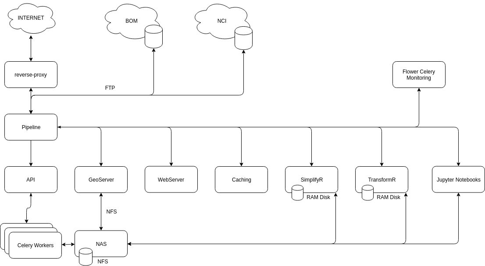

# The LFMC Project

Fuel moisture information is critical for quantifying and managing bushfire risk at both operational and strategic planning scales.  Accurate and timely information regarding fuel moisture across landscapes will improve bushfire risk estimates. Fire agencies cam use these data to the precision and accuracy of data and information supporting operational and strategic bushfire management planning. Operationally agencies will improve predictions of fire behaviour and the likely impacts, thereby improving their ability to allocate resources and protect people and property.  Strategically agencies can use more accurate and near real-time fuel moisture information to improve their capacity to plan for prescribed burning, enabling it to be more efficient, effective and safer.
A recent increase in research relating to landscape moisture assessment has substantially improved the capacity to predict Landscape Fuel Moisture Condition (LFMC). Yet, these improvements have only occasionally been translated into operational use by fire agencies. Some models may not be directly relevant for operational use in their current form while others may be relevant but still not adopted by fire agencies.  Agencies have therefore not benefited fully from their research investment. 
The [School of Ecosystem and Forest Sciences (SEFS)](https://ecosystemforest.unimelb.edu.au/) from the [University of Melbourne (UOM)](http://www.unimelb.edu.au) was engaged by the [Department of Environment, Land, Water and Planning (DELWP)](http://delwp.vic.gov.au) to synthesise existing LFMC research into a single operational system (website) for evaluating landscape fuel moisture condition. The project will represent the best available science in Australia in a single operational system. Outputs of this project, and their integration into state-agencies’ bushfire prediction and fuel monitoring systems, will greatly improve Victoria’s ability to prevent, prepare and respond to bushfires.

## LFMC and Fire Behaviour Prediction

Fuel moisture is a key component of many empirical fire spread models ([Rothermel 1972](); [Noble et al. 1980](); [Sullivan 2009](); [Cruz et al. 2015]()).  Fire agencies therefore require LFMC information for the prediction of fire spread for planned burns and bushfires. In the case of planned burning LFMC information is used to identify burn windows when the moisture conditions are suitable to conduct a burn safely and effectively.  For unplanned fires, LFMC information is used to predict fire spread rates during a fire and determine the potential for fire ignition and spread across the landscape throughout the fire season. 
Remotely sensed indices of fuel moisture are already available for grasslands (i.e. [grass curing]()) but there is no equivalent system for forests. In forests, weather forecasts are combined with local knowledge and on-ground measures of rainfall and fuel moisture (using the T-H Wiltronics Fine Fuel Moisture Meter) to estimate LFMC. Spatially explicit forecasts of forest fuel moisture derived from either remote sensing or physical models have the potential to greatly improve the quality of LFMC information available to fire managers. Forecasts of fuel moisture over a 3-7 day period in forests would improve the burn scheduling process, particularly if those forecasts capture fine-scale spatial variability in fuel moisture.  Forecasts of fuel moisture during bushfires and throughout the fire season would similarly enable more effective prioritisation of resources and allow for more accurate public advice about bushfire threats. 
One of the main limitations of new fuel moisture indices is the difficulty in linking fuel moisture to flammability or fire behaviour.  Empirical fire behaviour models have been developed through direct observation of fires and fuel moisture values.  Many of these models have been in existence for many decades prior to the advent of remote sensing methods and therefore have not considered the vast range of potential metrics which are currently available.  For example, the McArthur forest fire spread model uses drought factor which is argued to represent the proportion of available fuels ([Noble et al. 1980]()).  Drought factor is derived from rainfall and the days since the last rain but is an abstract quantity that cannot be measured and therefore data from new models cannot easily be substituted.  Future fire behaviour research should where possible incorporate remotely sensed fuel moisture values to examine where relationships exist, if at all.

## LFMC and Strategic Planning

Fuel moisture models (FMM) are used in strategic fire planning independent of fire spread models.  Relative or absolute values of fuel moisture are used to identify the extent and connectivity of dry or drying fuels and hence the potential for large fires in the landscape.  Decisions are made based on historical events under similar circumstances and known thresholds.  This information can be used over long timeframes for a fire season outlook (e.g. [Bushfire and Natural Hazard Cooperative Research Centre 2017]()).  Results of such analyses are then used for strategic planning such as the creation of contracts with fire-fighting aircraft operators, positioning of resources within administrative boundaries and requests for resources from interstate or internationally.  Over shorter timeframes, LFMC information can be used for a variety of purposes.  This can include defining the start and finish of the fire danger periods or the declaration of fire bans. 
New fuel moisture models can be more readily incorporated into fire planning.  Absolute values often require calibration for use in fire spread models, but are appropriate for landscape planning and identifying high risk areas.  Relative values are also acceptable for prioritizing across landscapes, but require greater caution when there are significant social or economic consequences for decisions made on these data.  

---

## System Objectives
The objective of this project is to synthesise existing LFMC research into a single operational system for forecasting landscape fuel moisture condition. Outputs of this project, and their integration into state-agencies’ bushfire prediction and fuel monitoring systems, will greatly improve Victoria’s (and Australia more broadly) ability to prevent, prepare and respond to bushfires. 

FMMs each utilise specific metrics, spatial and temporal scales, and as such, apply to the environment in different ways. This project brought these varying models into a single unified platform to provide a means of comparing each product across the Victorian (and sometimes Australian) landscape , and dynamically generates, stores and publishes the FMM values.

---

## System Overview

The LFMC Project was developed in collaboration with the [University of Melbourne](http://www.unimelb.edu.au), [DELWP](http://delwp.vic.gov.au), and the [BNHCRC](https://www.bnhcrc.com.au/).
The LFMC system is built on a MicroService Architecture for modularity, scalability, security, and flexibility.

**Data sources**
The system draws upon raw data products published by the [Bureau of Meterology](https://www.bom.gov.au) and the [National Computing Infrastructure GeoNetwork](https://geonetwork.nci.org.au/).

---

## Outcomes

The project provides a system with a range of metrics to predict landscape fuel moisture. Expertise within the project team and the workshop participants has ensured that these models represent the best available science in Australia and potentially internationally.  Furthermore, the tools developed for downloading the data allow for these inputs to be incorporated into bushfire risk modelling in an operational and strategic sense.

Tools were created to allow the fine grained analysis of each model using spatial and temporal search parameters using common formats such as GeoJSON and ESRI Shapefiles.

The availability of data is determined by the release cycles of the authors including the publishing times of the upstream providers.

The system has been developed to be 'self-healing' and highly performant. However while it will pro-actively seek missing source datasets, communication errors, permissions, or licensing, could possibly prevent timely delivery of results.