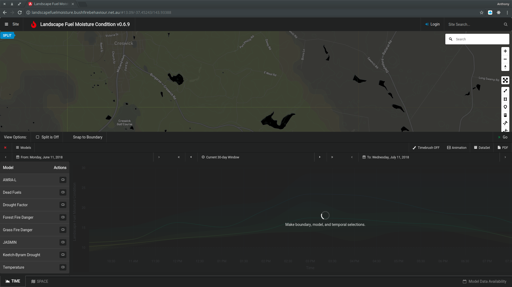
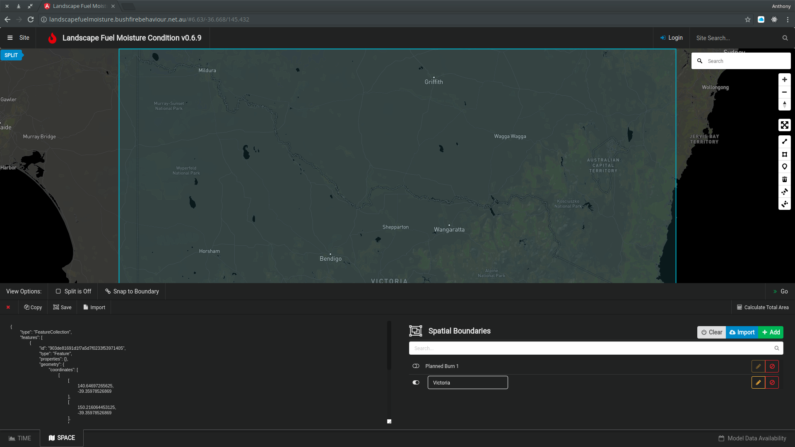
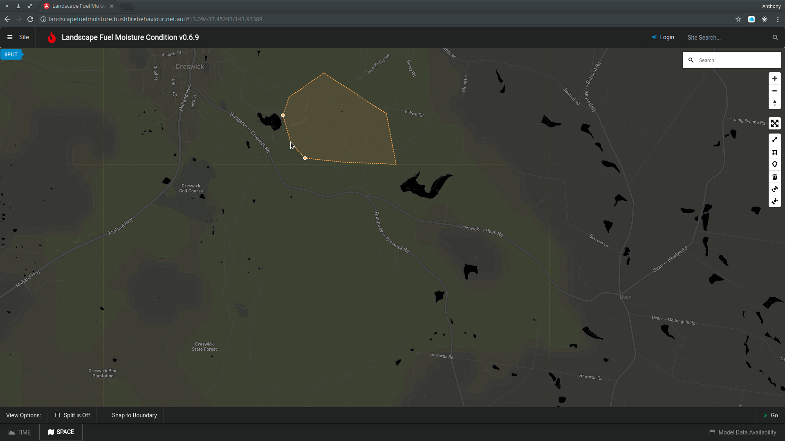
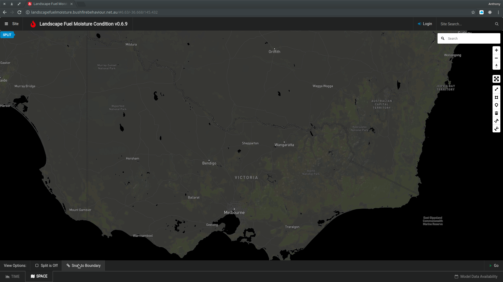
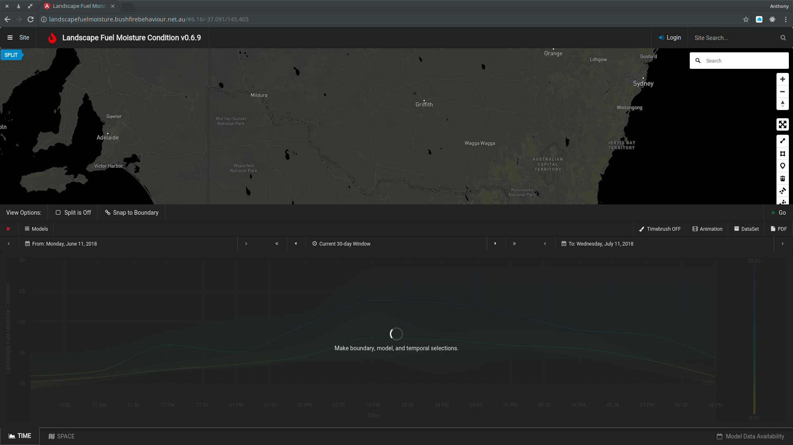
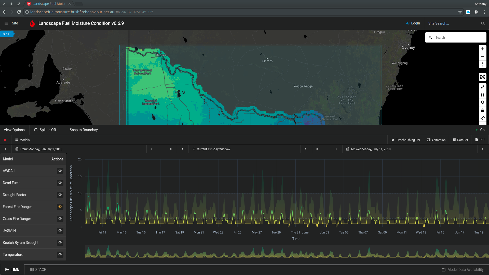
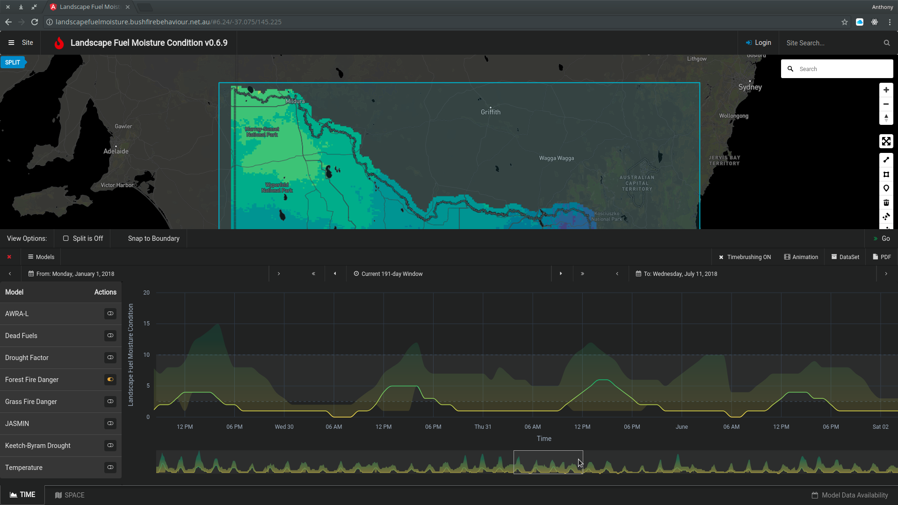
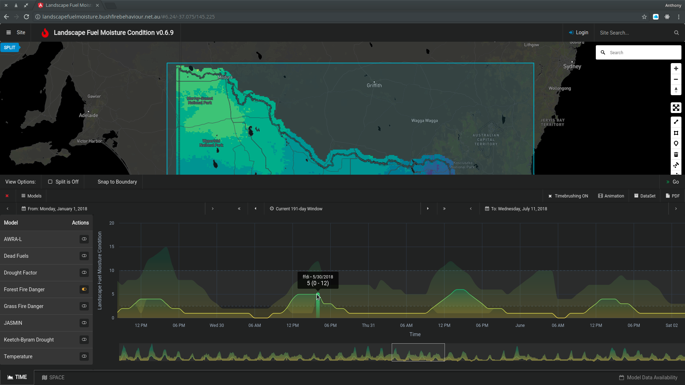
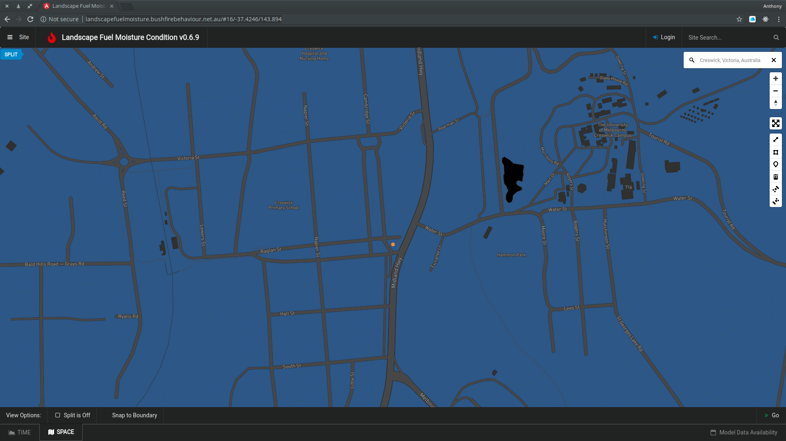

# Making a query

<iframe src="https://player.vimeo.com/video/281608754" width="640" height="400" frameborder="0" webkitallowfullscreen mozallowfullscreen allowfullscreen></iframe>

<a href="https://vimeo.com/281608754">LFMC Tutorial Sample</a> from <a href="https://vimeo.com/user25751496">Anthony Rawlins</a> on <a href="https://vimeo.com">Vimeo</a>.

### Model Selection

 
 
 See: Models

### Spatial Selections

There are two main methods for making spatial selections.
   + By importing a shape from either GeoJSON or SHP
   + By drawing a polygon by hand using the drawling tools
 
 We have provided some pre-defined example selections for all users...
 
 
 
#### Polygon Selection
Use the Polygon Tool to draw a selection.

Polygons are always enclosed when drawn using the polygon tool. An Error will be reported if the polygon was not fully enclosed when imported.

> **To avoid weird behaviour when drawing.**
> Turn **OFF** *Snapping to Boundary*

#### Loading a GeoJSON File
GeoJSON can be copy/pasted into the SPACE window. Pasting new data will overwrite the current spatial selection but will not be saved until clicking the Orange Pencil (Save) Icon.

#### Importing a SHP file
Shape files (and their auxillaries) can be imported using the provided upload/import tool. These SHP fiels are converted on the server to GeoJSON format, and will be made available for selection.

> ### Important note on file storage and persistence
> Data that is drawn or imported by the user is stored *in **your** browser's local storage*. This means if you log in on another machine, or via a different browser, your selections will **NOT** be available unless you reload them. The selections **will persist** on the *same machine over different sessions* though.

### Temporal Selections

Temporal selections can be made from a start to a finish date in the TIME Panel.

Use the calendar chooser (by clicking the date) on both the left and right side of th TIME Panel to select the day to start and end accordingly.
All records available between (inclusive) these dates will be used to plot your results.

The temporal selection is indicated by the *Current Time Window*. This window can be advanced or regressed by a day at atime by clicking its surrounding single arrows. The double arrows indicate advancing or regressing the current time window by its full length, ie., a 7 day window will be moved by a week if the double arrows are used.

The start and finish dates can simarly be advanced or regressed by a day by using the single arrows.

### Temporal Results

#### Viewing fine-grained data by Time-brushing

#### Interpretting temporal results

Values can be inspected by hovering your mouse over a series. Refer to the Model description for specifics on what the value actually conveys. Some Models use indexes while yet others use scalar values.

> ## Some Important caveats
> **Use caution when comparing values!**
> Models can use varying scales and a value of 0.8 in a range(0...1) can be more significant than 2 in a range(0-100).
> Some Models use a *moisture level*, while others use a *moisture defecit* This means sometimes diverging series can indicate similar moisture trends. For specific model information, please refer to their respective publications.

TODO...
Appropriate Ranges
Temporal Resolution

> ### Important note about value interpolation
> Values tha are plotted in the TIME Panel are interpolated using a specific algorithm to provide the simplest interpretation. Lines between observed values are indicative only and should not be used as an accurate representation of fuel moisture or index levels.

## Geo-location
Use the Map's Search field to find specific named locations.

