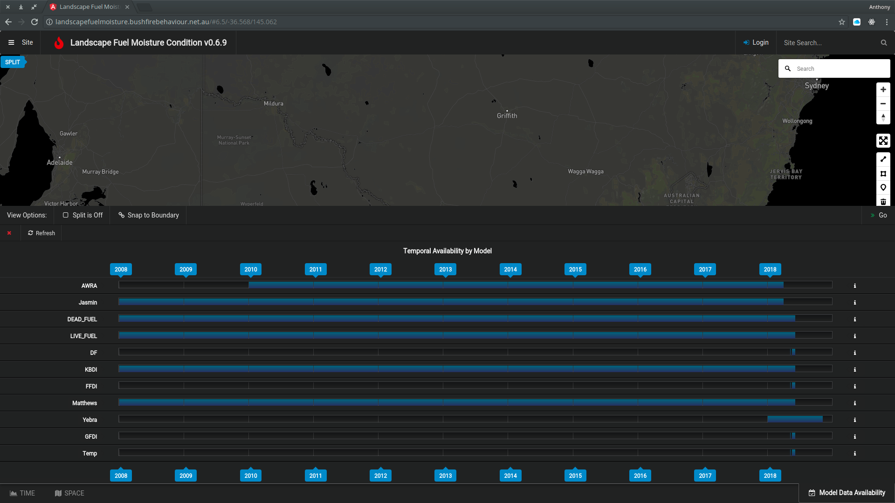

# Models

#### Model By Strata

| Strata       | Model(s)               |
| ------------ | ---------------------- |
| Canopy       | [LFMC](nolan.md), [LVMC](yebra.md), [FFDI](indices.md)       |
| Sub-canopy   | [LFMC](nolan.md), [LVMC](yebra.md), [FFDI](indices.md)       |
| Elevated     | [LFMC](nolan.md), [LVMC](yebra.md), [FFDI](indices.md)       |
| Near-surface | [LFMC](nolan.md), [LVMC](yebra.md), [DFMC](nolan.md), [GFDI](indices.md) |
| Surface      | [DFMC](nolan.md), [JASMIN](), [GFDI](indices.md), [DF](indices.md), [Curing](indces.md) |
| Root zone    | [AWRA-L](awra.md)                |
| Upper soil   | [AWRA-L](awra.md)                |
| Deep soil    | [AWRA-L](awra.md)                |

See: [Model Descriptions](http://landscapefuelmoisture.bushfirebehaviour.net.au/models) and [metadata](http://api.landscapefuelmoisture.bushfirebehaviour.net.au/v1/models)

Dynamic Temporal Availability is shown on the [Reference Website](http://landscapefuelmoisture.bushfirebehaviour.net.au)

